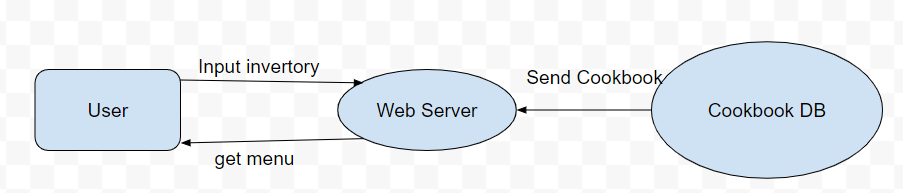
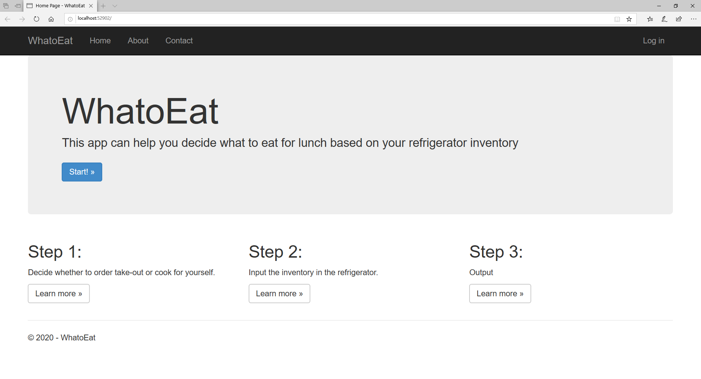
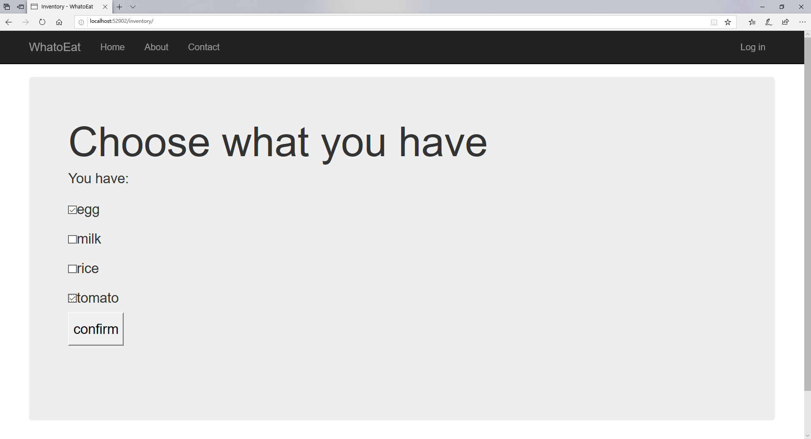
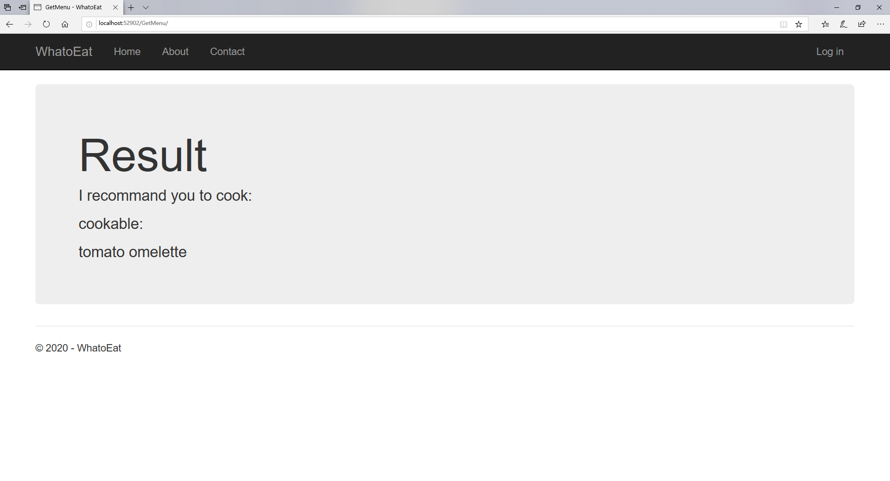

# WhatoEat
Help you decide  your lunch   
Have you ever looked at a full refrigerator and didn't know what to cook? Sometime you may hope to have a random function to help you make decision.  
This app will help you analyse what you can cook by your inventory, and then help you make decision by a random function(Or a weighted random in future). You will get a menu for your lunch/dinner. If you still don't know how to cook, It will have explain for different dishes(To do).   
In future, the app will include user function, to store your choose and use that in weighted random function. Users can also upload cookbook by themselves. Other users can also make disscussions/evaluation about the cookbook.   

# Function:   
Inventory - cookable function (done)   
Add user function (done, but need to polish in future)   
Using database to save more menu(modifying)   
Add recommand function(to do)   

# Flow Chart:  
This is how the system will work(for demo)  
  
After the analysis, the QPS for the application will not be very high. It is enough for the database to Read & write for every request by user. So we needn't to use cache to load the cookbook.   
For storage, the cookbook + user_table + evaluation will not occupation to much space(enough for 1TB). No need to consider sharding for now.   

# Demonstration:  
At first, the homepage is build by the model of Django,  
   

Click the start, then we can see the inventory page where you can choose what you have:  
   

After you confirm your inventory, the app will get what you can cook by your inventory.
   
